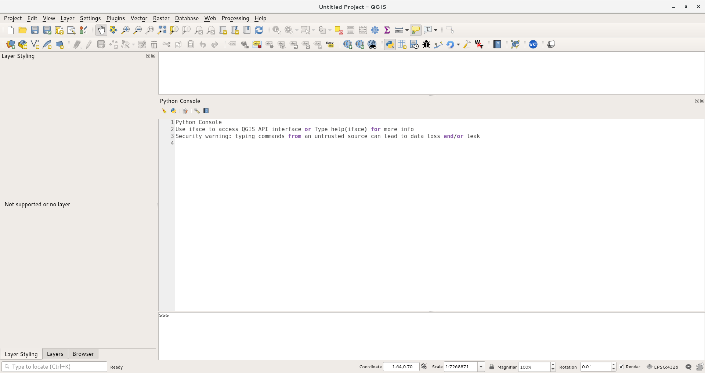

Using the QGIS Python console
=============================

QGIS has a powerful programming interface that allows you to extend the
core functionality of the software as well as write scripts to automate
your tasks. QGIS supports the popular Python scripting language. Even if
you are a beginner, learning a little bit of Python and QGIS programming
interface will allow you to be much more productive in your work. This
tutorial assumes no prior programming knowledge and is intended to give
an introduction to python scripting in QGIS (PyQGIS). 


This tutorial is based on ["QGIS Tutorials and Tips v1.0"](https://www.qgistutorials.com/en/) by Ujaval Gandhi, updated to use
Python 3 and QGis 3 by Ian Turton.

Overview of the task
--------------------

We will load a vector point layer representing all major airports and
use python scripting to create a text file with the airport name,
airport code, latitude and longitude for each of the airport in the
layer.

Get the data
------------

We will use the
[Airports](http://www.naturalearthdata.com/downloads/10m-cultural-vectors/airports/)
dataset from Natural Earth.

Download the [Airports
shapefile](http://www.naturalearthdata.com/http//www.naturalearthdata.com/download/10m/cultural/ne_10m_airports.zip).


Procedure
---------

1.  In QGIS, go to Layers --&gt; Add Vector Layer. Browse to the
    downloaded `ne_10m_airports.zip` file and click Open. Select the
    `ne_10m_airports.shp` layer and click OK. Or drag and drop the
    `.zip` or `.shp` file into the map window.
1.  You will see the `ne_10m_airports` layer loaded in QGIS.

    [](images/start/2.png)

1.  Select the Identify tool and click on any of the points to examine
    the available attributes. You will see that the name of the airport
    and it's 3 digit code are contained in the attributes `name` and
    `iata_code` respectively.

    [](images/start/3.png)

4.  QGIS provides a built-in console where you can type python commands
    and get the result. This console is a great way to learn scripting
    and also to do quick data processing. Open the Python Console by
    going to Plugins --&gt; Python Console.

    [](images/start/4.png)

5.  You will see a new panel open at the bottom of QGIS canvas. You will
    see a prompt like `>>>` at the bottom where you can type commands.
    For interacting with the QGIS environment, we must use the `iface`
    variable. To access the currently active layer in QGIS, you can type
    the following and press Enter. This command fetches the reference to
    the currently loaded layer and stores it in the `layer` variable.

    ```python
      layer = iface.activeLayer()
    ```
    [](images/start/5.png)

1.  There is a handy function called `dir()` in python that shows you
    all available methods for any object. This is useful when you are
    not sure what functions are available for the object. Run the
    following command to see what operations we can do on the `layer`
    variable.

    ```python
    dir(layer)
    ```

    [](images/start/6.png)

7.  You will see a long list of available functions. For now, we will
    use a function called `getFeatures()` which will gets you the
    reference to all features of a layer. In our case, each feature will
    be a point representing an airport. You can type the following
    command to iterate through each of the features in the current
    layer. Make sure to add 2 spaces before typing the second line.

    ```python
    for f in layer.getFeatures():
      print(f)
    ```

    [](images/start/7.png)

8.  As you will see in the output, each line contains a reference to a
    feature within the layer. The reference to the feature is stored in
    the `f` variable. We can use the `f` variable to access the
    attributes of each feature. Type the following to print the `name`
    and `iata_code` for each airport feature.

    ```python
    for f in layer.getFeatures():
      print(f"{f['name']}, {f['iata_code']}")
    ```

    [](images/start/8.png)

9.  So now you know how to programatically access the attribute of each
    feature in a layer. Now, let's see how we can access the coordinates
    of the feature. The coordinates of a vector feature can be accessed
    by calling the `geometry()` function. This function returns a
    geometry object that we can store in the variable `geom`. You can
    run `asPoint()` function on the geometry object to get the x and y
    coordinates of the point. If your feature is a line or a polygon,
    you can use `asPolyline()` or `asPolygon()` functions. Type the
    following code at the prompt and press Enter to see the x and y
    coordinates of each feature.

    ```python
    for f in layer.getFeatures():
      geom = f.geometry()
      print(geom.asPoint())
    ```

    [](images/start/9.png)

10. What if we wanted to get only the `x` cordinate of the feature? You
    can call the `x()` function on the point object and get its x
    coordinate.

    ```python
    for f in layer.getFeatures():
      geom = f.geometry()
      print(geom.asPoint().x())
    ```

    [](images/start/10.png)

11. Now we have all the pieces that we can stitch together to generate
    our desired output. Type the following code to print the name,
    `iata_code`, `latitude` and `longitude` of each of the airport features.
    The `%s` and `%f` notations are ways to format a string and number
    variables.

    ```python
    for f in layer.getFeatures():
      geom = f.geometry()
      print(f"{f['name']:40s}\t{f['iata_code']},\t({geom.asPoint().y():.2f},{geom.asPoint().x():.2f})")

    ```

    [](images/start/11.png)

12. You can see the output printed on the console. A more useful way to
    store the output would be in a file. You can type the following code
    to create a file and write the output there. Replace the file path
    with a path on your own system. Note that we add `\n` at the end of
    our line formatting. This is to add a newline after we add the data
    for each feature. 

    ```python

    with open("/home/ian/airports.csv","w") as output_file:
        for f in layer.getFeatures():
            geom = f.geometry()
            line = f"{f['name']:50s}\t{f['iata_code']},\t({geom.asPoint().y():.2f},{geom.asPoint().x():.2f})\n"
            o=output_file.write(line)

    ```

    [](images/start/12.png)

13. You can go to the output file location you specified and open the
    text file. You will see the data from the airports shapefile that we
    extracted using python scripting.

    [](images/start/13.png)
