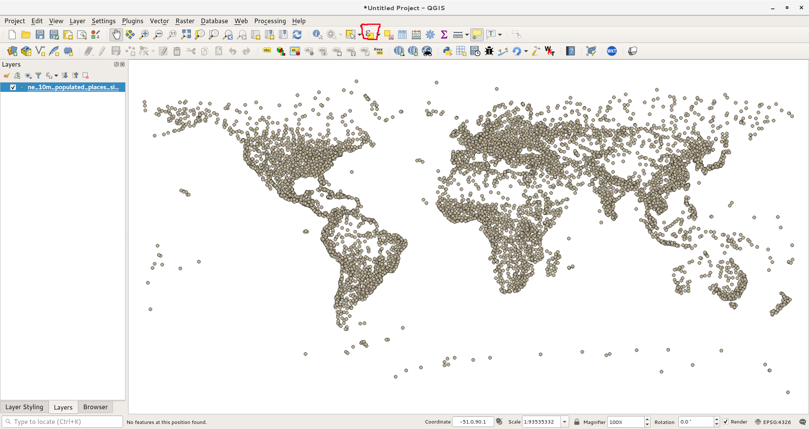
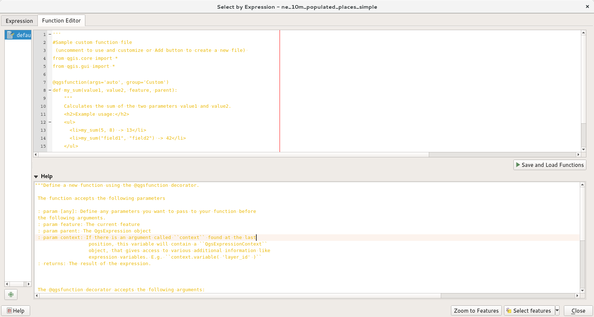
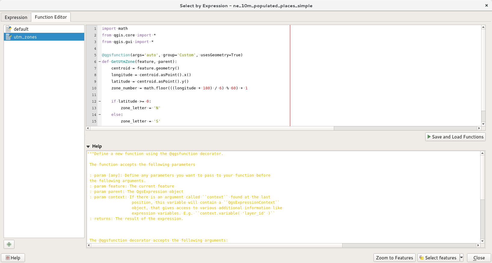
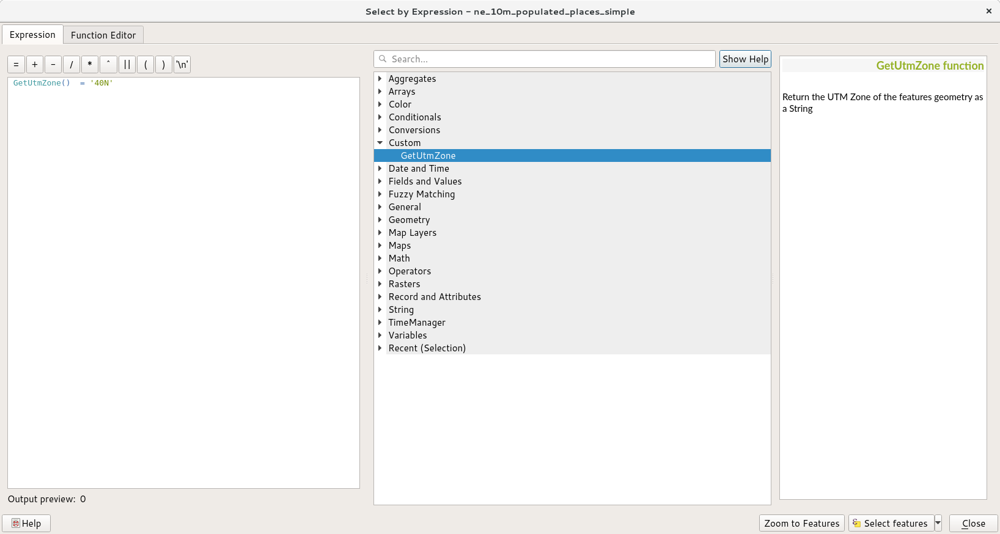
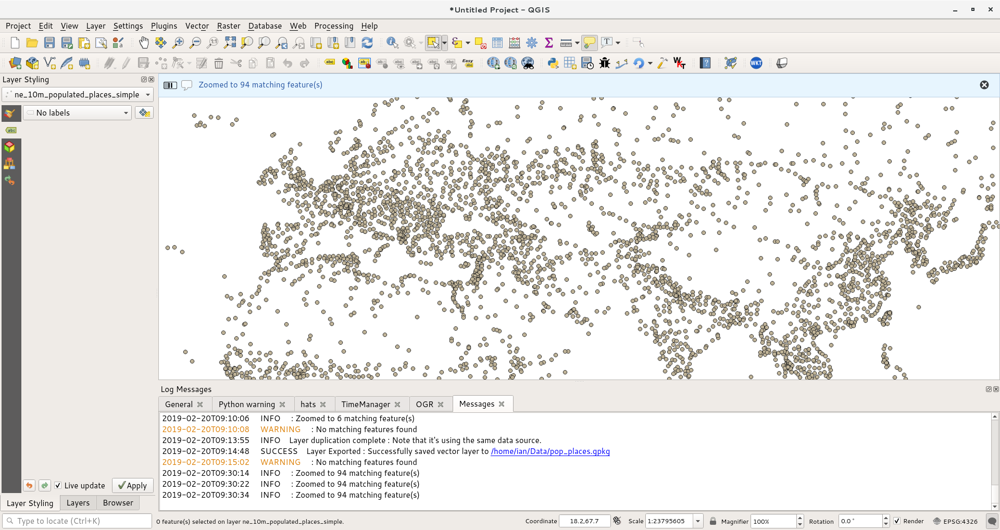
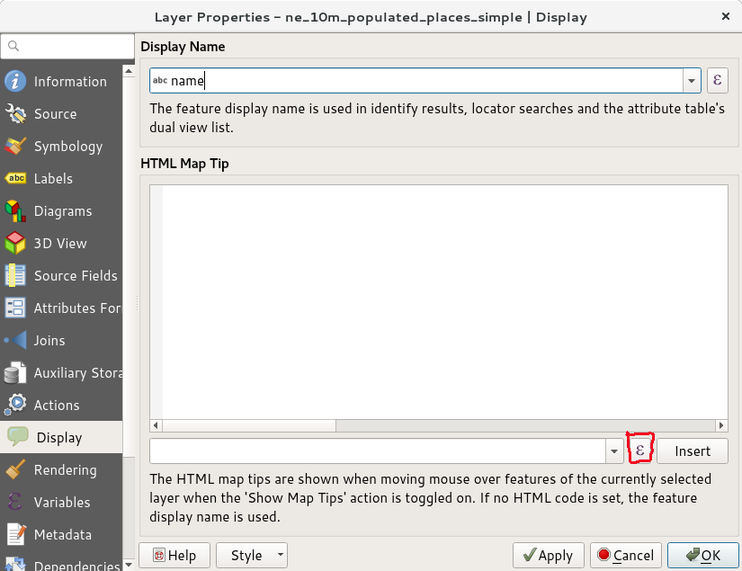
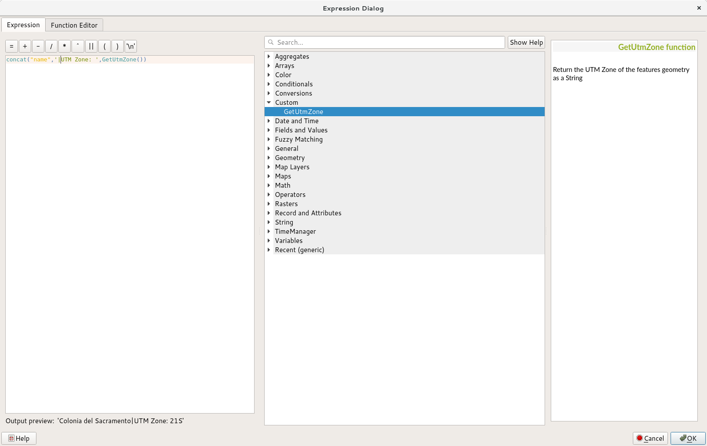
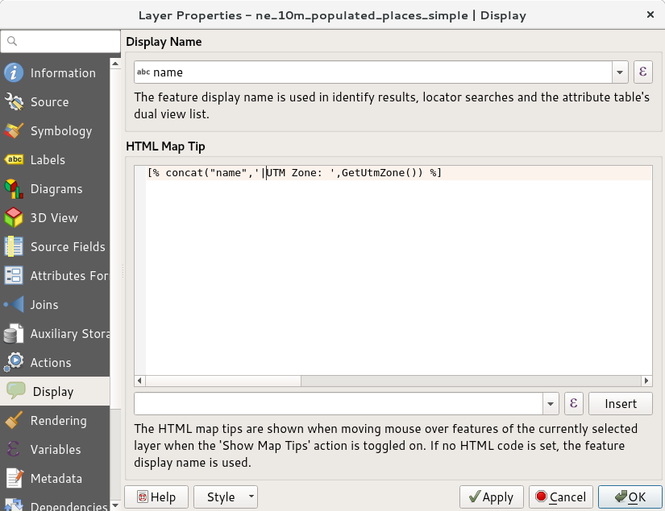
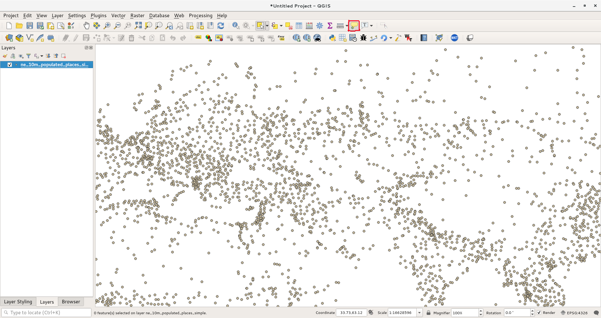
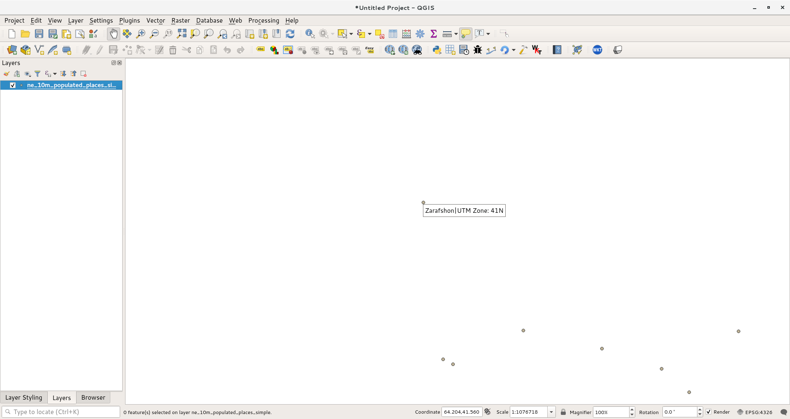

Using Custom Python Expression Functions
========================================

Expressions in QGIS have a lot of power and are used in many core
features -selection, calculating field values, styling, labelling etc.
QGIS also has support for user-defined expressions. With a little bit of
python programming, you can define your own functions that can be used
within the expression engine.

This tutorial is based on ["QGIS Tutorials and Tips
v1.0"](https://www.qgistutorials.com/en/) by Ujaval Gandhi, updated to
use Python 3 and QGis 3 by Ian Turton.


Overview of the task
--------------------

We will define a custom function that finds the UTM Zone of a map
feature and use this function to write an expression that displays the
UTM zone as a map tip when hovered over the point.

### Other skills you will learn

-   How to use the `Map Tips` tool to display custom text when hovering
    over a feature.

Get the data
------------

We will use Natural Earth's [Populated
Places](http://www.naturalearthdata.com/downloads/10m-cultural-vectors/10m-populated-places/)
dataset. Download the [simple (less columns)
dataset](http://www.naturalearthdata.com/http//www.naturalearthdata.com/download/10m/cultural/ne_10m_populated_places_simple.zip)

Procedure
---------

1.  Open QGIS and go to Layers --&gt; Add Vector --&gt; Add Vector
    Layer. Or browse to the downloaded `ne_10m_populated_places_simple.zip` file
    and drag it into the map window.

    [](images/func/2.png)

1.  Go to View --&gt; Select --&gt; Select By Expressions.... or click the icon:

    [](images/func/3.png)

1.  Switch to the Function Editor tab. Here you can write any PyQGIS
    code that will be executed by the expression engine.

    [](images/func/4.png)

1.  We will define a custom function named `GetUtmZone` that will
    calculate the UTM zone number for each feature. Since custom
    functions in QGIS work at the feature level. We will use the
    centroid of the feature's geometry and compute the UTM Zone from the
    latitude and longitude of the centroid geometry. We will also add a
    'N' or 'S' designation to the zone to indicate whether the zone is
    in the northern or southern hemisphere. 

    Press the `plus` button in the lower left of the screen and type
    `utm_zones.py` as the file name. Then type the following code into the
    editor window. When you are finished click `Save and Load Functions` (on the
    right).
    
    
    >UTM Zones are longitudinal projection zones numbered from 1 to 60. Each
    >UTM zone is 6 degree wide. Here we use a simple mathematical formula to
    >find the appropriate zone for a given longitude value. Note that this
    >formula doesn't cover some special UTM zones.

    ```python
    import math
    from qgis.core import *
    from qgis.gui import *

    @qgsfunction(args=0, group='Custom', usesgeometry=True)
    def GetUtmZone(value1, feature, parent):
        """Return the UTM Zone of the feature's geometry as a String"""
        centroid = feature.geometry()
        longitude = centroid.asPoint().x()
        latitude = centroid.asPoint().y()
        zone_number = math.floor(((longitude + 180) / 6) % 60) + 1

        if latitude >= 0:
            zone_letter = 'N'
        else:
            zone_letter = 'S'

        return '%d%s' % (int(zone_number), zone_letter)
    ```

    [](images/func/5.png)

1.  Switch to the Expression tab in the Select by
    expression dialog. Find and expand the Custom group in the Functions
    section. You will notice a new custom function `GetUtmZone` in the
    list. We can now use this function in the expressions just like any
    other function. Type the following expression in the editor. This
    expression will select all points that fall in the UTM Zone `40N`.
    Click `Zoom to Features` and the map will change, if you click `Select
    Features` you should see the points in UTM zone 40N change colour to yellow.

    ```
    GetUtmZone() = '40N'
    ```

    [](images/func/7.png)

8.  Back in the main QGIS window, you should see many points highlighted
    in yellow. These are the points falling in the UTM Zone we specified
    in the expression. But you can see we have zoomed in to the UTM zone.

    [](images/func/8.png)

9.  You saw how we defined and used a custom function to select features
    by expression. We will now use the same function in another context.
    One of the hidden gems in QGIS is the `Map Tip` tool. This tool
    shows user-defined text when you hover over a feature. Right-click
    the `ne_10m_populated_places_simple` layer and select Properties.

    [](images/func/9.png)

10. Switch to the Display tab. Here you can enter any
    text that will be displayed when you hover over the features of the
    layer. Even better, you can use layer field values and expressions
    to define a much more useful message. Click on the `Ɛ` button.

11. You will see the familiar expression editor again. We will use the
    `concat` function to join the value of the field `name` and the
    result of our custom function `GetUtmZone`. Enter the following
    expression and click OK.

    ```
    concat("name",'|UTM Zone: ',GetUtmZone())
    ```

    [](images/func/11.png)

12. You will see the expression entered as the value of the Display
    text. Click `Insert` to add it to the HTML box and then press `OK`.

    [](images/func/12.png)

13. Before we proceed, let us de-select the features that were selected
    in the previous step. Go to
    View --&gt; Select --&gt; Deselect Features
    from All Layers.

    [](images/func/13.png)

14. Activate the `Map Tips` tool by going to View --&gt; Map
    Tips.

    [](images/func/14.png)

15. Zoom into any area of the map and put your mouse cursor over any
    feature. You will see the name of the city and corresponding UTM
    zone displayed as the map tip.

    [](images/func/15.png)
